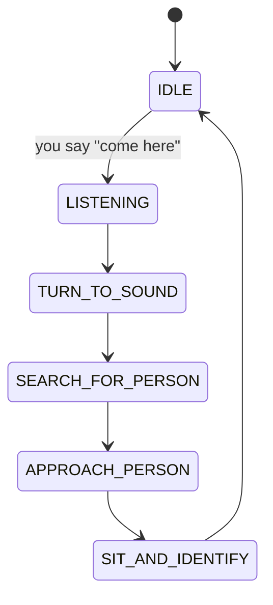
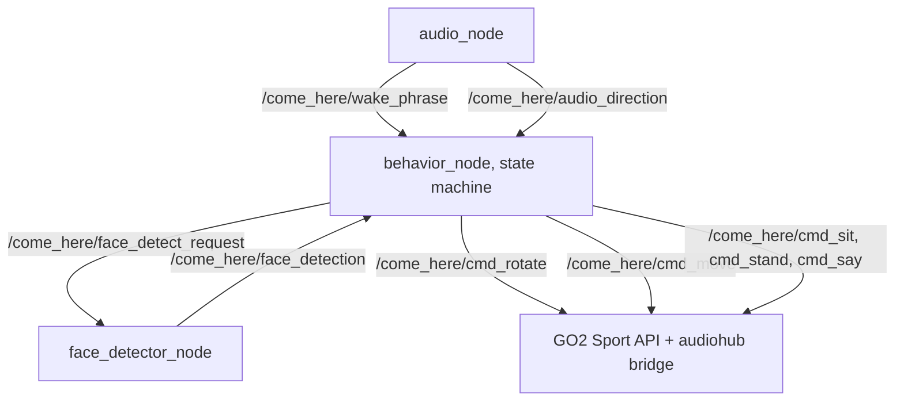

# come-here

[](LICENSE)
[](https://docs.ros.org/en/humble/)
[](#status)

An audio-visual approach system for the [Unitree GO2](https://www.unitree.com/go2) quadruped. The robot hears the phrase *"come here,"* estimates the speaker's direction from a microphone array, rotates toward them, locates them visually on the onboard camera, walks up, sits down in front of them, and says *"I am here."*

The stack runs entirely on the Jetson Orin NX payload attached to the robot, no external compute, no network dependency at runtime.

---

## Behavior



Per phase:

| Phase | What happens |
|---|---|
| Wake | faster-whisper (base.en, int8) streams raw ReSpeaker channel 1, a 300 Hz highpass filter rejects motor rumble, and a 3 s cooldown suppresses duplicates. |
| Direction | ReSpeaker firmware DOA is read over USB HID. The ROS `audio_node` publishes single-shot VAD-gated samples at 10 Hz. A filtered path (3 s window, IQR outlier rejection, circular median at ±π) exists on `ReSpeakerDOAProvider.get_latched_direction` but is not yet wired into the publish loop. |
| Rotate | The behavior node publishes the latest azimuth on `/come_here/cmd_rotate`. The bridge drives the GO2 Sport API with `Move(0, 0, cmd_z=2.0)` (~90°/s measured) for a duration proportional to the target angle. No deadzone, every rotation command is executed, so small angles still produce a short move. |
| Search | YOLO11n filters COCO class 0 (person). Bearing comes from bbox center + camera HFOV; distance comes from bbox height under a pinhole model with a 1.7 m person-height prior. |
| Approach | 10 Hz visual-servoing loop: while the person is detected, republish the latest bearing on `/come_here/cmd_rotate` and a constant `approach_speed` on `/come_here/cmd_move`. Stops when the distance estimate crosses `approach_stop_distance_m`. Falls back to `SEARCH_FOR_PERSON` if the person is lost for more than `lost_timeout_s`. Yaw control is open-loop per tick, no proportional controller in the MVP. |
| Sit + identify | Linear 4-substep sequence: sit (Sport API StandDown) → wait → fire a single MediaPipe face-detection inference on the latest frame → speak "I am here" via the GO2 audiohub API → wait → stand (Sport API BalanceStand) → return to IDLE. Face detection is informational in the MVP, not gating. |

---

## Architecture



Three functional nodes (audio, perception + face detector, behavior) communicate over typed topics. The behavior node is authoritative, everything downstream consumes its commands.

### Packages

| Package | Build | Role |
|---|---|---|
| `come_here_msgs` | `ament_cmake` | Typed messages: `AudioDirection`, `PersonDetection`, `WakePhrase`, `FaceDetection` |
| `come_here_audio` | `ament_python` | ReSpeaker DOA provider, Whisper wake-phrase detector, audio ROS node, streaming ring buffer, LoRA-capable inference path |
| `come_here_perception` | `ament_python` | YOLO11n person detector, MediaPipe face detector (on-demand), perception ROS node + face-detector ROS node |
| `come_here_behavior` | `ament_python` | Finite state machine: approach controller, sit-and-identify sequencer, placeholder command publishers |
| `come_here_bringup` | `ament_python` | Top-level launch file + combined parameter loading |

### Key abstractions

All sensor inputs are behind ABCs with mock and real implementations. This lets the full system run on a laptop with no hardware plugged in.

- **`AudioDirectionProvider`** → `MockAudioProvider`, `ReSpeakerDOAProvider` (pyusb HID, DOAANGLE + VOICEACTIVITY registers)
- **`WakePhraseDetector`** → `WhisperPhraseDetector` (faster-whisper CPU int8, optional HF + LoRA adapter, streaming segmenter + LatestOnlyQueue)
- **`PersonDetector`** → `MockPersonDetector`, `YoloPersonDetector` (ultralytics YOLO11n, class 0 only)
- **`FaceDetector`** → `MockFaceDetector`, `MediapipeFaceDetector` (MediaPipe short-range model, single-shot)

---

## Hardware stack

| Component | Part | Notes |
|---|---|---|
| Robot | Unitree GO2 EDU | Audio validated on EDU (not Pro or Air). Sport API over CycloneDDS. |
| Compute | Jetson Orin NX 16 GB | 25 W profile. ROS 2 Humble on Ubuntu 22.04. |
| Microphone | Seeed ReSpeaker Mic Array v2.0 (XMOS XVF-3000) | UAC1.0, 6-channel, 16 kHz. pyusb for HID control (AGC, DOA, VAD registers). |
| Camera | GO2 front camera via videohub API | JPEG frames over DDS. H.264 path and WebRTC path are currently broken; videohub is the working source. |
| Speaker | GO2 built-in (audiohub DDS API) | Base64-chunked WAV playback. Voice assets generated with edge-tts AriaNeural. |

---

## Messages and topics

### Messages (`come_here_msgs`)

| Msg | Purpose |
|---|---|
| `AudioDirection` | Sound source azimuth + confidence |
| `WakePhrase` | Detected phrase + confidence |
| `PersonDetection` | Bearing, distance, confidence, detected-flag |
| `FaceDetection` | Presence, count, confidence, normalized centroid |

### Topics

**Published by `audio_node`:**
- `/come_here/wake_phrase` (`std_msgs/String`)
- `/come_here/audio_direction` (`std_msgs/Float64MultiArray`: `[azimuth_rad, confidence]`)

**Published by `perception_node`:**
- `/come_here/person_detection` (`std_msgs/Float64MultiArray`: `[bearing_rad, distance_m, confidence, detected]`)

**Published by `face_detector_node`:**
- `/come_here/face_detection` (`come_here_msgs/FaceDetection`)

**Published by `behavior_node`:**
- `/come_here/state`: current state name
- `/come_here/cmd_rotate`: target yaw angle (rad)
- `/come_here/cmd_move`: forward velocity (m/s)
- `/come_here/cmd_sit`, `cmd_stand`: Sport API triggers
- `/come_here/cmd_say`: text for the audiohub bridge to vocalize
- `/come_here/face_detect_request`: triggers a single face-detection inference

The Sport API and audiohub are wrapped by `go2_bridge_node` (in this repo, under `come_here_behavior/`). The behavior node speaks through the placeholder topics above; the bridge translates them into `/api/sport/request` and `/api/audiohub/request` DDS messages. The bridge is launched automatically when `use_mock:=false` and skipped in mock mode, so `unitree_api` is only required on the robot.

---

## Build and run

### Prerequisites

- ROS 2 Humble on Ubuntu 22.04
- Python 3.10+
- `colcon`, `rosdep`
- Runtime deps (see `setup.sh`): `faster-whisper`, `sounddevice`, `numpy`, `mediapipe`, `ultralytics`, `scipy`, `opencv-python`
- Training deps (optional): `transformers`, `peft`, `accelerate`, `datasets`, `torch`, `torchaudio`

### Build

```bash
source /opt/ros/humble/setup.bash
cd /path/to/come-here
colcon build --symlink-install
source install/setup.bash
```

### Launch in mock mode (no hardware)

Mock mode skips `go2_bridge_node` (so `unitree_api` is not required) and
forces every sensor provider to its mock implementation (so `pyusb`,
`faster-whisper`, `ultralytics`, and `mediapipe` are not required either).

```bash
ros2 launch come_here_bringup come_here.launch.py use_mock:=true
ros2 topic echo /come_here/state

# Drive the state machine from another terminal:
ros2 topic pub --once /come_here/wake_phrase std_msgs/String 'data: "come here"'
ros2 topic pub --once /come_here/audio_direction std_msgs/Float64MultiArray '{data: [0.5, 0.9]}'
ros2 topic pub --once /come_here/person_detection std_msgs/Float64MultiArray '{data: [0.0, 1.5, 0.9, 1.0]}'
ros2 topic pub --once /come_here/person_detection std_msgs/Float64MultiArray '{data: [0.0, 0.5, 0.9, 1.0]}'   # "close enough"
```

### Launch on the robot

```bash
ros2 launch come_here_bringup come_here.launch.py use_mock:=false
```

Expects the ReSpeaker on USB, the GO2 in `BalanceStand`, and motion_switcher in "normal" mode. The launch file starts `go2_bridge_node` automatically in this mode, so the `unitree_api` ROS package must be installed on the Jetson and the GO2 DDS stack must be reachable.

### Run tests

The behavior and perception packages depend on generated `come_here_msgs`
headers, so you must build and source the workspace first:

```bash
source /opt/ros/humble/setup.bash
colcon build --symlink-install --packages-select come_here_msgs
source install/setup.bash
# Then build the rest if you have not already:
colcon build --symlink-install
source install/setup.bash

# Per-package tests (run from each package's own directory):
( cd come_here_audio       && python3 -m pytest test/ )
( cd come_here_perception  && python3 -m pytest test/ )
( cd come_here_behavior    && python3 -m pytest test/ )
( cd come_here_bringup     && python3 -m pytest test/ )
```

Running `pytest` across multiple `test/` directories from the workspace
root fails under ROS 2's pytest plugins because of duplicate module names.
Always invoke pytest from inside one package at a time.

---

## Training

`training/` contains a LoRA fine-tuning pipeline for the Whisper wake-phrase detector, in case ambient conditions need a domain-adapted model. None of this is required at runtime.

```
training/record_samples.py    # collect labeled positives / negatives
training/finetune_whisper.py  # LoRA fine-tune on top of base.en
training/evaluate.py          # accuracy + live mic eval vs baseline
```

The `WhisperPhraseDetector` class accepts an `adapter_path=` kwarg that points at a LoRA checkpoint and will load it through HF `peft`.

---

## Configuration

Per-package YAML files under each package's `config/`:

- `come_here_audio/config/audio_params.yaml`: mic device, channel, gain, Whisper model/device/compute_type, thresholds, VAD gating
- `come_here_perception/config/perception_params.yaml`: person detector (mock/YOLO), model path, confidence; face detector (mock/MediaPipe), min confidence
- `come_here_behavior/config/behavior_params.yaml`: tick rate, direction and person confidence thresholds, approach speed, stop distance, SIT_AND_IDENTIFY timing (`sit_settle_s`, `face_timeout_s`, `speak_hold_s`, `stand_settle_s`), spoken text

All of these are overridable at launch time via `--ros-args --params-file`.

---

## Parameters worth knowing

| Param | Default | Meaning |
|---|---|---|
| `approach_stop_distance_m` | 0.8 | Stop approach when estimated person distance falls below this |
| `approach_speed` | 0.3 | Forward velocity during `APPROACH_PERSON`, m/s |
| `lost_timeout_s` | 1.0 | How long to wait for a new detection before falling back to `SEARCH_FOR_PERSON` |
| `sit_settle_s` | 1.0 | Dwell after StandDown before firing the face detector |
| `face_timeout_s` | 1.5 | Max wait for a `FaceDetection` response |
| `speak_hold_s` | 5.0 | Dwell while "I am here" plays |
| `stand_settle_s` | 0.5 | Dwell after BalanceStand before returning to IDLE |

---

## Status

| Subsystem | Hardware-validated |
|---|---|
| ReSpeaker DOA over USB HID (29° frame offset, raw VAD-gated path wired into `audio_node`; filtered circular-median + IQR path exists in `ReSpeakerDOAProvider.get_latched_direction` but is not yet used at runtime) | Yes, raw path |
| Whisper wake-phrase (base.en CPU int8, highpass + cooldown + VAD-gate paths) | Yes |
| GO2 Sport API rotation (`cmd_z=2.0` ≈ 90°/s) | Yes |
| GO2 audiohub voice playback ("I am coming") | Yes |
| End-to-end hear→rotate | Yes |
| YOLO11n person detection via `/camera/image_raw` | Pending (implemented, bench script ready) |
| MediaPipe face detection on GO2 frames | Pending (implemented, bench script ready) |
| Approach controller + SIT_AND_IDENTIFY sequence | Pending (unit-tested; `go2_bridge_node` in-repo, hardware-side execution not yet validated end-to-end) |

---

## Known limits and follow-ups

- **Detection range ~1 m.** Motor noise on the GO2 is structure-borne (mechanical vibration through the chassis), not airborne, so software filters cannot extend range. A physical vibration-isolation mount for the ReSpeaker is the remaining lever.
- **Firmware VAD unusable while walking.** Motor noise pins `VOICEACTIVITY=0` permanently. A custom DOA path (GCC-PHAT on raw channels) is planned.
- **No owner identification yet.** The current MVP detects that a face is present; it does not identify whose face. Face embeddings + an enrolled reference are the next scope bump.
- **No depth-based stop.** Distance comes from a pinhole bbox-height estimate. Integrating the GO2's front ultrasonic is the next upgrade.
- **`cmd_rotate`/`cmd_move`/`cmd_sit`/etc. are placeholder topics.** `come_here_behavior/go2_bridge_node.py` in this repo translates them onto `/api/sport/request` and `/api/audiohub/request`. It is launched only when `use_mock:=false`, so mock development does not need `unitree_api` or the GO2 DDS stack.

---

## License

MIT, see individual `package.xml` files.

## Maintainer

Yusuf Guenena · <yusuf.a.guenena@gmail.com>
