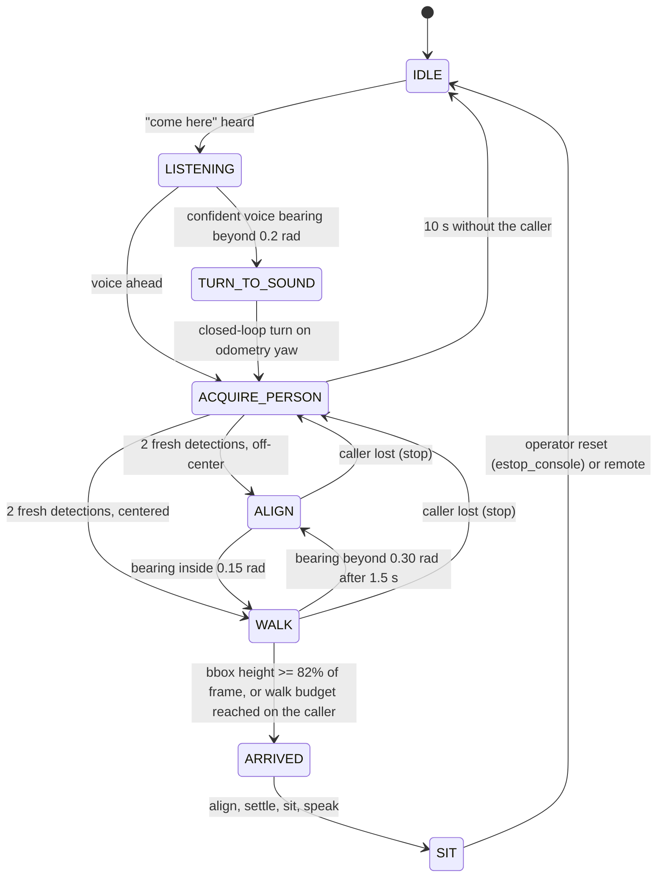

# come-here

[](LICENSE)
[](https://docs.ros.org/en/humble/)
[](#status)

A "come here" behavior for the [Unitree GO2](https://www.unitree.com/go2) quadruped. A person says *"come here"*, the robot says "I am coming.", turns toward the voice using the microphone array's direction estimate, finds the caller with its front camera, walks up to them, stops about 0.8 m away and sits.

Everything runs on the Jetson Orin NX payload on the robot, with no network dependency at runtime.

---

## The supported demo

```bash
source scripts/demo_env.sh
./scripts/demo_preflight.sh                                              # never moves the robot
ros2 launch come_here_bringup professor_demo.launch.py                   # dry run: robot never moves
ros2 launch come_here_bringup professor_demo.launch.py dry_run:=false    # live
ros2 run come_here_behavior estop_console                                # second terminal
```

The operator runbook, safety rules, lab validation ladder and recovery steps are in [docs/professor_demo.md](docs/professor_demo.md). All demo parameters live in [`come_here_bringup/config/professor_demo.yaml`](come_here_bringup/config/professor_demo.yaml), one comment per value.

## Behavior


```mermaid
stateDiagram-v2
    [*] --> IDLE
    IDLE --> LISTENING: "come here" heard
    LISTENING --> TURN_TO_SOUND: confident voice bearing beyond 0.2 rad
    LISTENING --> ACQUIRE_PERSON: voice ahead
    TURN_TO_SOUND --> ACQUIRE_PERSON: closed-loop turn on odometry yaw
    ACQUIRE_PERSON --> ALIGN: 2 fresh detections, off-center
    ACQUIRE_PERSON --> WALK: 2 fresh detections, centered
    ALIGN --> WALK: bearing inside 0.15 rad
    WALK --> ALIGN: bearing beyond 0.30 rad after 1.5 s
    ALIGN --> ACQUIRE_PERSON: caller lost (stop)
    WALK --> ACQUIRE_PERSON: caller lost (stop)
    ACQUIRE_PERSON --> IDLE: 10 s without the caller
    WALK --> ARRIVED: bbox height >= 82% of frame, or walk budget reached on the caller
    ARRIVED --> SIT: align, settle, sit, speak
    SIT --> IDLE: operator reset (estop_console) or remote
```

| Stage | What happens |
|---|---|
| Wake | ReSpeaker Mic Array v2.0 beamformed channel, an adaptive energy gate with pre-roll, faster-whisper `base.en` int8 on the CPU (capped at 2 threads), fuzzy match on "come here". |
| Direction | The ReSpeaker built-in DOA (DOAANGLE, offset -90 deg on this mount), one bearing per matched utterance. The bridge turns in place until `/utlidar/robot_odom` yaw has moved by that bearing. Without a confident bearing the robot does not walk. |
| Acquire | YOLO11n person detection, once per new camera frame, only inside a +/-35 deg gate around the voice bearing. Two consecutive fresh detections are required before any motion. If nobody is in view, the robot scans a full circle in 45 deg steps. |
| Align / walk | The stock `mcf` gait cannot combine forward motion and yaw cleanly, so ALIGN turns in place (yaw only) and WALK goes straight (0.6 m/s, no yaw), with hysteresis and minimum phase times. The bridge republishes Move at 20 Hz to keep the gait latched. |
| Stop | The person's bounding box filling 82% of the frame height (LiDAR and pinhole distance read long at close range). Backstops: caller lost for 0.3 s, no valid detection for 1.5 s, a dead camera, a 20 s approach limit and a commanded walking-distance budget. |

| Arrive | Final yaw-only align, 1 s standing still, Sit, "Made it." / "Here I am.", stay seated until the operator resets. |

`skip_turn_to_sound:=true` restores the camera-only behavior. `scripts/install_come_here_service.sh --enable` installs a systemd service that starts the stack at boot (dry run unless `.come_here_live` exists in the checkout).

## Safety

- **Motion gate** (`go2_bridge_node` + pure `motion_gate.py`): rejects malformed, non-finite and absurd velocity commands (they stop the robot), clamps valid ones, rejects combined forward + yaw, and stops the robot 0.5 s after commands stop arriving.
- **E-stop**: `/come_here/estop` true latches in both the bridge and the state machine. Release does not resume motion; a new "come here" is required.
- **Motion mode**: the bridge sends a read-only CheckMode and refuses all motion unless the robot reports `mcf`. Nothing in this repository sends SelectMode, and the bridge refuses to start with api id 1001 (Damp) configured on the Sport topic.
- **Shutdown**: Ctrl+C or SIGTERM publishes StopMove before the process exits (verified by a process-level test with an independent subscriber).
- **Dry run**: `dry_run:=true` (the demo default) sends Sport requests to `/come_here/dry_run/sport_request` instead of the robot.

## Packages

| Package | Role |
|---|---|
| `come_here_msgs` | Message definitions |
| `come_here_audio` | Whisper wake phrase detector and far-field front end, ReSpeaker DSP tuning, microphone selection, DOA provider |
| `come_here_perception` | YOLO person detector, LiDAR distance resolver, face detector (experimental) |
| `come_here_behavior` | State machine (`come_here_fsm.py`), behavior node, GO2 bridge, motion gate, trial log, operator tools |
| `come_here_bringup` | `professor_demo.launch.py` (supported) and `come_here.launch.py` (experimental) |

Main topics: `/come_here/wake_phrase`, `/come_here/person_detection`, `/come_here/cmd_velocity` (`[vx, yaw_rate]`), `/come_here/estop`, `/come_here/state`, `/come_here/trial_summary`, `/come_here/bridge_status`, `/come_here/audio_health`.

## Build and test

```bash
source /opt/ros/humble/setup.bash
colcon build --symlink-install
source install/setup.bash
for p in come_here_behavior come_here_audio come_here_perception come_here_bringup; do
  (cd $p && python3 -m pytest test -q)
done
```

Run pytest from inside each package: every package ships a `test/__init__.py`, and running them in one session collides. Tests that import the GO2 bridge need the Unitree `unitree_api` message package and are skipped without it.

## Evidence

Each trial appends a JSON line to `~/come_here_trials/trials.jsonl` (git commit, wake source and latency, acquisition latency, ALIGN/WALK counts, lost events, stop reason, final bounding box, e-stop, success). `ros2 run come_here_behavior trial_report` prints a PASS/FAIL table and records operator verdicts.

## Live hardware result

On 2026-09-15, two live end-to-end trials on the physical GO2 completed the full sequence (wake phrase, caller direction, turn, visual person acquisition, approach, stop, sit), running onboard the Jetson Orin NX. One was a blind trial, where the caller's position was not disclosed in advance; in it, the robot reached `DONE: sitting` about 12.8 s after wake-phrase detection (behavior-node log, `IDLE -> LISTENING` to `DONE: sitting`). Other attempts in the same session did not complete, including an attempt that timed out after an incorrect direction estimate.

These two runs show that the complete behavior executes on hardware. They are not a robustness or performance study, and 12.8 s describes one trial, not typical timing. The robot checkout was recorded as `047825b` with uncommitted changes, which were committed afterwards on this line; the exact executed source state is not fully reconstructable from Git history. Trial IDs: `20260915T225451-001` (caller at the robot's right), `20260915T230644-001` (blind trial).

## Status

| Subsystem | Hardware evidence |
|---|---|
| Wake phrase (far-field front end, whole-token "come here" matcher) | Live wakes in the 2026-09-14 and 2026-09-15 trials; 49 of 57 recorded "come here" and 0 false wakes on replay |
| Turn toward the voice (built-in DOA + closed-loop odometry turn) | Live on 2026-09-14 (caller at the robot's left) and 2026-09-15 (right, and the blind trial); one right-side attempt read +141 deg and failed |
| YOLO acquisition, ALIGN / WALK, bounding-box stop, sit | Demonstrated in the 2026-09-14 and 2026-09-15 live trials |
| Motion gate, mcf check, e-stop, shutdown stop, dry run | Unit and process tests; the remote-stick e-stop latched on the robot on 2026-09-15 |
| Boot service | Reboot-tested in dry run on 2026-09-15; live boot path not yet exercised |
| Face detection after sitting | Not working: no face detected from the seated camera view |

### Experimental: Come Here ANY

A separate, opt-in entry point (`come_here_any.launch.py`) reuses this caller pipeline and hands locomotion to the GO2's onboard obstacle avoidance. It is not the supported demo and has **not moved the robot yet**: only its no-motion API checks and software tests exist. Design, evidence and the hardware ladder: [docs/come_here_any.md](docs/come_here_any.md).

## Known limits

- One caller. Nobody closer to the robot than the caller.
- The voice bearing is occasionally wrong (a held DOA register); the full-circle scan recovers some of these.
- Wake range with the robot's own noise is not yet measured with the new front end.
- LiDAR distance reads long while walking at close range; the bounding-box fraction carries the stop.
- The mcf forward gait drifts left about 0.1 to 0.2 m over 3 s of walking.
- YOLO runs on the Jetson CPU (about 1 to 2 Hz measured in April 2026).
- The camera publisher script that feeds `/camera/image_raw` lives on the robot's payload, not in this repository.

## Training

`training/` holds an optional LoRA fine-tuning pipeline for the Whisper detector (`record_samples.py`, `finetune_whisper.py`, `evaluate.py`). It is not needed at runtime.

## License

MIT, see [LICENSE](LICENSE).

## Maintainer

Yusuf Guenena · <yusuf.a.guenena@gmail.com>
