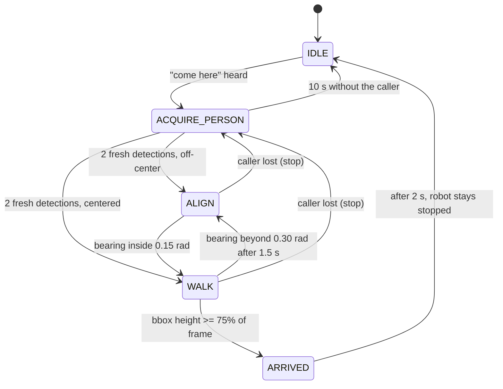

# come-here

[](LICENSE)
[](https://docs.ros.org/en/humble/)
[](#status)

A "come here" behavior for the [Unitree GO2](https://www.unitree.com/go2) quadruped. A person says *"come here"*, the robot finds them with its front camera, turns to face them if needed, walks straight toward them and stops about 0.8 m away.

Everything runs on the Jetson Orin NX payload on the robot, with no network dependency at runtime.

---

## The supported demo

```bash
source scripts/demo_env.sh
./scripts/demo_preflight.sh                                              # never moves the robot
ros2 launch come_here_bringup professor_demo.launch.py                   # dry run: robot never moves
ros2 launch come_here_bringup professor_demo.launch.py dry_run:=false    # live
ros2 run come_here_behavior estop_console                                # second terminal
```

The operator runbook, safety rules, lab validation ladder and recovery steps are in [docs/professor_demo.md](docs/professor_demo.md). All demo parameters live in [`come_here_bringup/config/professor_demo.yaml`](come_here_bringup/config/professor_demo.yaml), one comment per value.

## Behavior


```mermaid
stateDiagram-v2
    [*] --> IDLE
    IDLE --> ACQUIRE_PERSON: "come here" heard
    ACQUIRE_PERSON --> ALIGN: 2 fresh detections, off-center
    ACQUIRE_PERSON --> WALK: 2 fresh detections, centered
    ALIGN --> WALK: bearing inside 0.15 rad
    WALK --> ALIGN: bearing beyond 0.30 rad after 1.5 s
    ALIGN --> ACQUIRE_PERSON: caller lost (stop)
    WALK --> ACQUIRE_PERSON: caller lost (stop)
    ACQUIRE_PERSON --> IDLE: 10 s without the caller
    WALK --> ARRIVED: bbox height >= 75% of frame
    ARRIVED --> IDLE: after 2 s, robot stays stopped
```

| Stage | What happens |
|---|---|
| Wake | ReSpeaker Mic Array v2.0 beamformed channel, an adaptive energy gate with pre-roll, faster-whisper `base.en` int8 on the CPU (capped at 2 threads), fuzzy match on "come here". |
| Acquire | YOLO11n person detection, once per new camera frame. Two consecutive fresh detections are required before any motion. |
| Align / walk | The stock `mcf` gait cannot combine forward motion and yaw cleanly, so ALIGN turns in place (yaw only) and WALK goes straight (0.6 m/s, no yaw), with hysteresis and minimum phase times. The bridge republishes Move at 20 Hz to keep the gait latched. |
| Stop | The person's bounding box filling 75% of the frame height (LiDAR and pinhole distance read long at close range). Backstops: caller lost for 0.3 s, no valid detection for 1.5 s, a dead camera, a 20 s approach limit and a commanded walking-distance budget. |

TURN_TO_SOUND (ReSpeaker DOA) and SIT_AND_IDENTIFY (sit, face detection, speech, stand) still exist for the experimental stack (`come_here.launch.py`) but are off in the demo.

## Safety

- **Motion gate** (`go2_bridge_node` + pure `motion_gate.py`): rejects malformed, non-finite and absurd velocity commands (they stop the robot), clamps valid ones, rejects combined forward + yaw, and stops the robot 0.5 s after commands stop arriving.
- **E-stop**: `/come_here/estop` true latches in both the bridge and the state machine. Release does not resume motion; a new "come here" is required.
- **Motion mode**: the bridge sends a read-only CheckMode and refuses all motion unless the robot reports `mcf`. Nothing in this repository sends SelectMode, and the bridge refuses to start with api id 1001 (Damp) configured on the Sport topic.
- **Shutdown**: Ctrl+C or SIGTERM publishes StopMove before the process exits (verified by a process-level test with an independent subscriber).
- **Dry run**: `dry_run:=true` (the demo default) sends Sport requests to `/come_here/dry_run/sport_request` instead of the robot.

## Packages

| Package | Role |
|---|---|
| `come_here_msgs` | Message definitions |
| `come_here_audio` | Whisper wake phrase detector and far-field front end, ReSpeaker DSP tuning, microphone selection, DOA provider |
| `come_here_perception` | YOLO person detector, LiDAR distance resolver, face detector (experimental) |
| `come_here_behavior` | State machine (`come_here_fsm.py`), behavior node, GO2 bridge, motion gate, trial log, operator tools |
| `come_here_bringup` | `professor_demo.launch.py` (supported) and `come_here.launch.py` (experimental) |

Main topics: `/come_here/wake_phrase`, `/come_here/person_detection`, `/come_here/cmd_velocity` (`[vx, yaw_rate]`), `/come_here/estop`, `/come_here/state`, `/come_here/trial_summary`, `/come_here/bridge_status`, `/come_here/audio_health`.

## Build and test

```bash
source /opt/ros/humble/setup.bash
colcon build --symlink-install
source install/setup.bash
for p in come_here_behavior come_here_audio come_here_perception come_here_bringup; do
  (cd $p && python3 -m pytest test -q)
done
```

Run pytest from inside each package: every package ships a `test/__init__.py`, and running them in one session collides. Tests that import the GO2 bridge need the Unitree `unitree_api` message package and are skipped without it.

## Evidence

Each trial appends a JSON line to `~/come_here_trials/trials.jsonl` (git commit, wake source and latency, acquisition latency, ALIGN/WALK counts, lost events, stop reason, final bounding box, e-stop, success). `ros2 run come_here_behavior trial_report` prints a PASS/FAIL table and records operator verdicts.

## Status

| Subsystem | Hardware evidence |
|---|---|
| Whisper wake phrase with the previous fixed gate | Ran on the robot in April 2026; unreliable at about 2 m (1 of 3 attempts heard on 2026-04-21) |
| Far-field front end (adaptive gate, pre-roll, DSP profile) | Software only: unit tests and a synthetic distance sweep. Not yet run on the robot |
| YOLO detection and the 75% bounding-box stop | One full hardware loop on 2026-04-24, stopped about 0.8 m from the operator |
| ALIGN / WALK phase controller | Ran on the robot on 2026-04-21 and 2026-04-24 |
| Current state machine, motion gate, mcf check, shutdown stop, dry run | Software only: unit tests, a multi-process dry run and a mock launch. Hardware validation pending |
| TURN_TO_SOUND (DOA) | Experimental; the DOA register was observed stuck on the robot |
| Sit, face detection | Experimental; off in the demo |

## Known limits

- One caller, standing in the camera view when they speak.
- Wake range with the robot's own noise is not yet measured with the new front end.
- LiDAR distance reads long while walking at close range; the bounding-box fraction carries the stop.
- The mcf forward gait drifts left about 0.1 to 0.2 m over 3 s of walking.
- YOLO runs on the Jetson CPU (about 1 to 2 Hz measured in April 2026).
- The camera publisher script that feeds `/camera/image_raw` lives on the robot's payload, not in this repository.

## Training

`training/` holds an optional LoRA fine-tuning pipeline for the Whisper detector (`record_samples.py`, `finetune_whisper.py`, `evaluate.py`). It is not needed at runtime.

## License

MIT, see [LICENSE](LICENSE).

## Maintainer

Yusuf Guenena · <yusuf.a.guenena@gmail.com>
