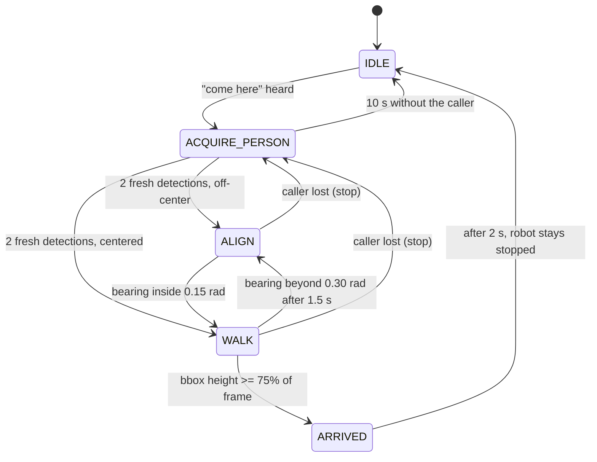

# Class demo: "come here"

One caller stands about 2.5 m in front of a standing GO2 and says "come here".
The robot hears it, finds the caller with the front camera, turns to face them
if needed, walks straight toward them, and stops about 0.8 m away. That is the
whole demo.

Status: every step below is implemented and exercised in software (unit tests,
a multi-process dry run, a mock-mode launch). **None of the current code has
been run on the robot yet.** The lab ladder in this document is how it gets
validated. Record failures, not just successes.

## What runs



| Process | Role |
|---|---|
| camera publisher script | GO2 front camera to `/camera/image_raw` |
| `audio_node` | ReSpeaker beam channel, adaptive gate, Whisper `base.en`, publishes `/come_here/wake_phrase` |
| `perception_node` | YOLO person detection, one result per new camera frame |
| `behavior_node` | the state machine above, trial log |
| `go2_bridge_node` | Sport API Move/StopMove at 20 Hz; validation, watchdog, e-stop latch, mcf check |

Motion rules the robot's stock `mcf` gait needs: ALIGN turns in place (yaw
only) and WALK goes straight (forward only, 0.6 m/s). No command ever mixes
the two.

Stopping: the primary stop is the person's bounding box filling 75% of the
frame height, which stopped the robot about 0.8 m away on the last hardware
run. Backstops, all of which also stop the robot: caller lost for 0.3 s, no
valid detection for 1.5 s, a dead camera, 20 s approach limit, and a 2.0 m
walking budget sized for the 2.5 m start mark.

## Safety rules

- The operator holds the Unitree remote the whole time. It is the primary stop.
- A second person sits at the e-stop console (Enter engages the e-stop).
- Clear corridor: 4 m long and 2 m wide in front of the robot. Only the caller inside it.
- The robot must be standing, in its default `mcf` mode. Never change the motion
  mode, and never send `SelectMode` "normal" (it wedges the robot until a power cycle).
  The bridge refuses all motion unless the robot reports `mcf`.
- Caller starts on a tape mark 2.5 m from the robot's front. If you use another start
  distance D, launch with `max_walk_distance_m:=<D minus 0.5>`.
- Abort (remote or e-stop) on: any yaw while walking, shaking in place, the robot
  still walking at 0.8 m, anyone entering the corridor.

## Setup

On the development machine, run the tests, then copy the workspace to the Jetson
without deleting robot-only files (`models/`, `deps/`):

```bash
for p in come_here_behavior come_here_audio come_here_perception come_here_bringup; do
  (cd $p && python3 -m pytest test -q)
done
rsync -a --exclude build --exclude install --exclude log --exclude models \
      --exclude deps --exclude __pycache__ ./ <jetson>:~/come-here/
```

On the Jetson (no internet in the lab, so all models must already be there):

```bash
cd ~/come-here
source /opt/ros/humble/setup.bash
# If a previous build was made at another path: rm -rf build install log
colcon build --symlink-install
```

Every terminal on the Jetson starts with:

```bash
source ~/come-here/scripts/demo_env.sh
```

Terminals: T1 launch, T2 e-stop console, T3 checks and trial report.

## Lab ladder

Do not skip stages. Each has a pass condition.

### Stage A: static bringup (no motion possible)

```bash
T1  ./scripts/demo_preflight.sh
T1  ros2 launch come_here_bringup professor_demo.launch.py           # dry run
T3  ./scripts/demo_preflight.sh --live
T2  ros2 run come_here_behavior estop_console
```

Pass: both preflights print `DEMO PREFLIGHT: PASS`; the e-stop console reports 2
subscribers; T1 logs `audio: ... calibrated=True` every 5 s. Say "come here" from
the 2.5 m mark: T1 logs `Wake phrase detected` and `ACQUIRE_PERSON`. Try 5 times
and write down how many were heard. If fewer than 4 of 5, compare
`respeaker_profile:=none` and `adaptive_gate:=false` (relaunch, 5 tries each).

### Stage B: static perception (still dry run)

```bash
T3  ros2 topic echo /come_here/person_detection
```

Fields: `[bearing, distance, confidence, detected, bbox_h_frac, distance_source, frame_age]`.
Caller on the 2.5 m mark: `detected` 1.0 steadily, bearing near 0 when centered,
positive when the caller is on the robot's left. Walk slowly toward the robot and
note `bbox_h_frac` at 1.0 m and at 0.8 m (it should cross 0.75 near 0.8 m).
Then say "come here" and watch the dry-run commands:

```bash
T3  ros2 topic echo /come_here/dry_run/sport_request
```

Pass: Move parameters are `{"x": 0.6, "y": 0.0, "z": 0.0}` or yaw-only; walking up
to the robot produces `ARRIVED` and a StopMove (api_id 1003). Nothing moves.

### Stage C: stop path on the live bridge (robot standing, no motion commanded)

```bash
T1  Ctrl+C, then: ros2 launch come_here_bringup professor_demo.launch.py dry_run:=false
```

Nobody says "come here". Pass: T1 logs `motion mode 'mcf' verified`; pressing Enter
in T2 logs `ESTOP ENGAGED` and the robot does not move; `release` in T2; Ctrl+C in
T1 exits cleanly; the robot stays standing throughout.

### Stage D: one short straight walk (MOVES THE ROBOT)

Live launch running, nobody in camera view, remote in hand, 3 m clear:

```bash
T3  python3 scripts/short_walk_test.py        # 0.6 m/s for 1.5 s
```

Pass: clean trot about 0.9 m forward, no yaw, clean stop, stays stopped.

### Stage E: centered "come here" (MOVES THE ROBOT)

Caller on the 2.5 m mark, centered, full body in view. Say "come here".
Expected: "I am coming", then WALK (a short ALIGN is fine), stop about 0.8 m away,
stays stopped. Measure the gap from the robot's front to the caller's toes, then:

```bash
T3  ros2 run come_here_behavior trial_report --mark PASS --distance 0.85
T3  ros2 run come_here_behavior trial_report --mark FAIL --note "what happened"
T3  ros2 run come_here_behavior trial_report --mark FAIL --no-trial --note "wake missed"
```

A trial passes only if: the wake was heard by voice (not injected), the caller was
acquired, the gait was clean, there was no contact, the final gap was 0.6 to 1.1 m,
and the robot stayed stopped.

### Stage F: repeat Stage E until 5 consecutive passes

`trial_report` prints the streak. Log every attempt, including misses. Record a
phone video of a passing run (landscape, whole corridor visible, sound on).

### Stage G (optional): 10 to 20 degrees left or right

Caller on the 2.5 m arc, off center. Expected ALIGN (turn in place), WALK, stop.
Only after Stage F passes.

Optional safety demonstrations once Stage F passes: the caller steps out of view
mid-walk (the robot stops within about half a second and waits; it gives up after
10 s), and the e-stop mid-walk (stops; a new trial needs `release` and a new
"come here").

## Recovery

| Problem | Action |
|---|---|
| Anything unexpected | Remote, or Enter in T2 |
| No wake detection | `ros2 topic echo /come_here/audio_health`: `capture_age_s` should stay below 1. If the ReSpeaker was unplugged, replug it; `audio_node` respawns in 2 s |
| Camera or detections stopped | `python3 scripts/topic_probe.py rate /camera/image_raw image 3`. The camera script and `perception_node` respawn by themselves; if still 0, Ctrl+C T1 and relaunch |
| Topics listed but no data | Ctrl+C T1, `ros2 daemon stop`, re-source `demo_env.sh` in every terminal, relaunch |
| Launch crashed or stuck | Ctrl+C T1 (sends StopMove), `pgrep -af lib/come_here_` to confirm nothing is left, relaunch |
| Bridge refuses motion (mode) | The robot is not in `mcf`. Restore it with the remote or power cycle. Never SelectMode "normal" |
| E-stop engaged | `release` in T2; the next "come here" starts a fresh trial |

## Evidence

Every trial appends one JSON line to `~/come_here_trials/trials.jsonl`: git
commit, wake source (`audio` or injected `topic`), wake confidence and latency,
acquisition latency, ALIGN and WALK phase counts, lost and stale events, stop
reason, final bounding box and distance, e-stop, and the automatic success flag.
Operator verdicts go to `trial_marks.jsonl` through `trial_report --mark`.

## Configuration

Everything that changes demo behavior is in
`come_here_bringup/config/professor_demo.yaml`, with a comment per value. Launch
arguments: `dry_run` (default true), `use_mock`, `camera`, `camera_script`,
`respeaker_profile`, `adaptive_gate`, `max_walk_distance_m`, `trial_log_dir`.
